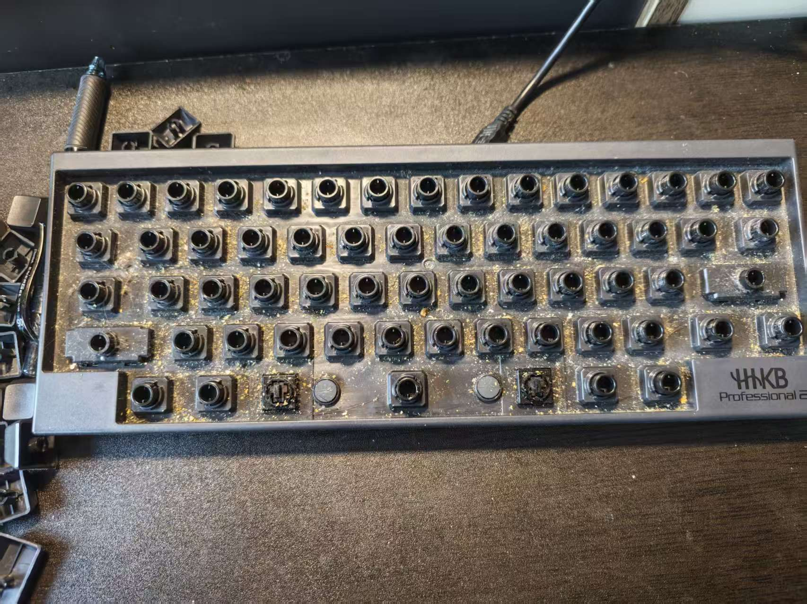
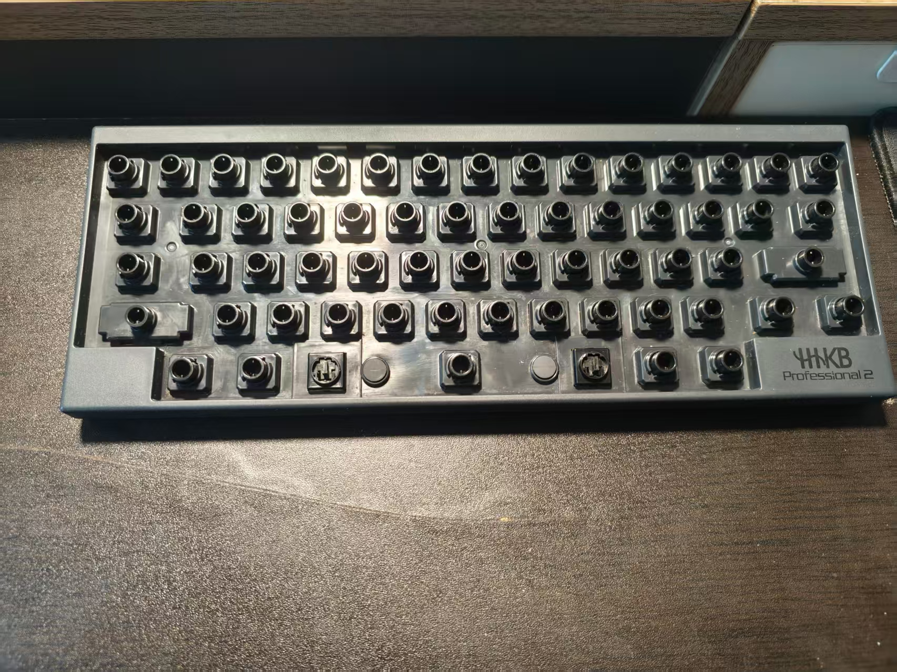
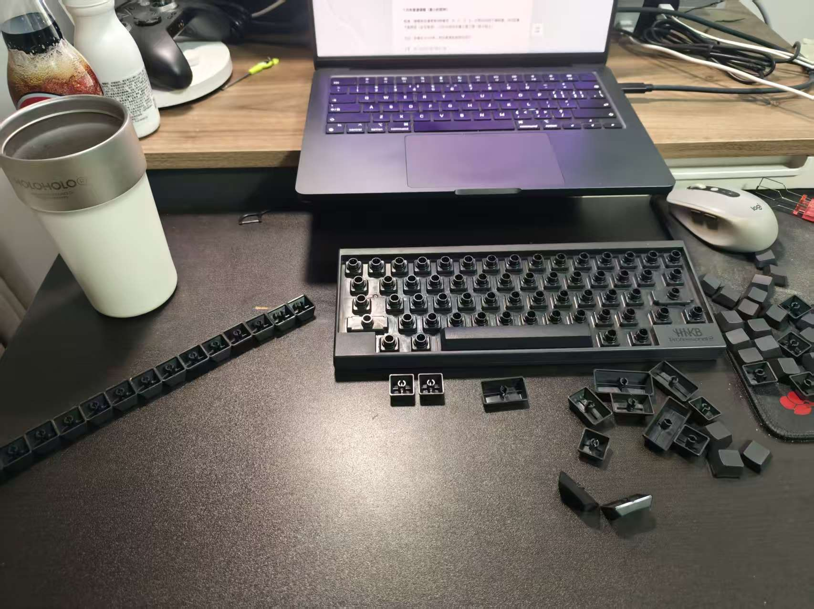
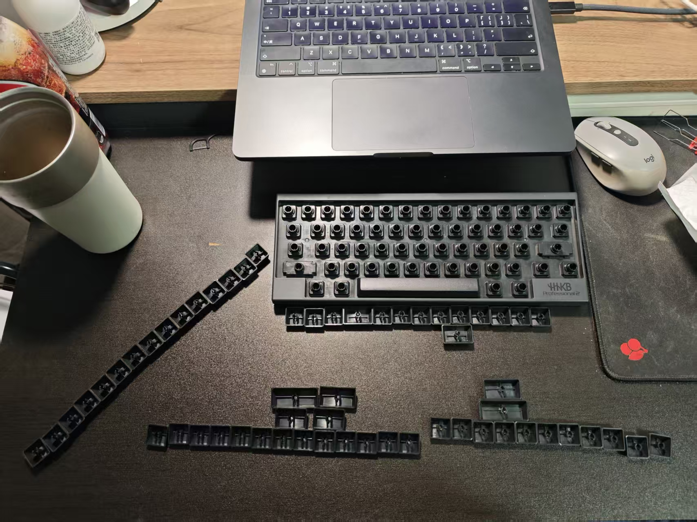
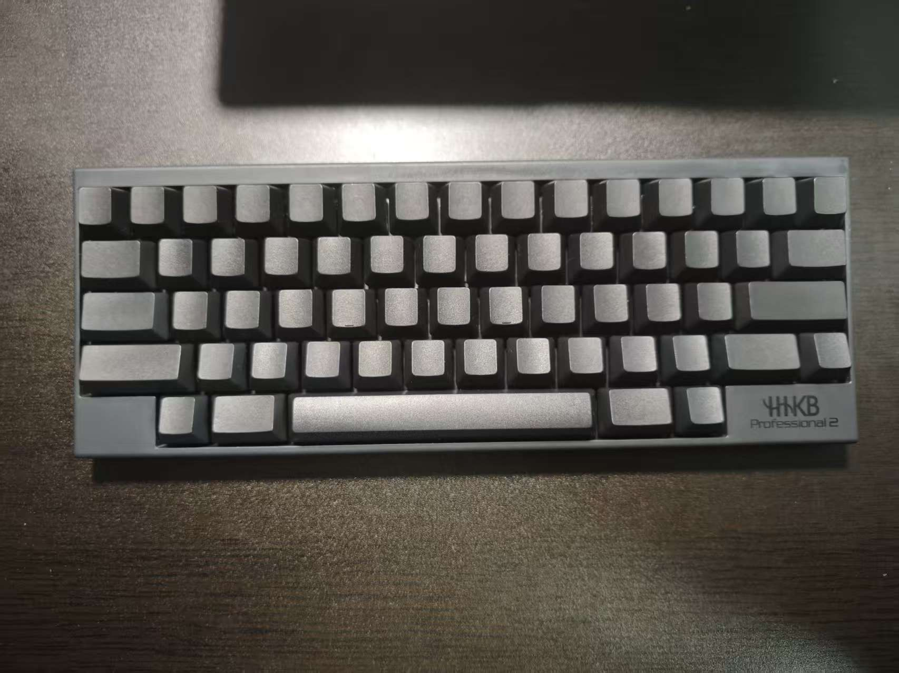

## 前言

2022 年的时候水群说一直想买 HHKB 但是没有入手，雷少说他有两把正好有一把闲置的黑色无刻版 HHKB Pro 2 的便寄给我了让我体验一下

当时拿到手很不适应因为是无刻各种找不到键，记了一下快捷键和键位图后拿着这把键盘狂水一下午群后我爱上了这种手感

但是!!!! 这把键盘一直没有归还给雷少，他说买了新键盘让我先用着（感恩🥹），就这样这把键盘键盘被我霸占到现在，期间也没有好好清洁过，最近有点看不下去了，决定还她清白

## 拆除清洁

拆开前 

拆开后 刚吃了东西的谨慎观看 

用刷子把键盘本体的各种脏东西先刷掉，然后用湿巾擦拭干净，键帽用温水加少量洗洁精浸泡一会儿然后逐个清洁干净晾干备用

## 安装还原

开始安装键帽，一脸懵逼装了几个发现都不太对劲，又都拆掉了 

经过一些搜索和观察得出以下规律

HHKB 的键帽每一行有不一样的倾斜角度一共 5 行 60 键,从最上一排往下依次是,为了方便区分键帽的内侧标有行号字母

- E 15 键 - 无特殊
- D 14 键 2 特殊键 左 Tab 右 Backspace 大小长度一致
- C 13 键 2 特殊键 左 Control 右 Enter Enter 键长度更长一些 同时这一行有 J K 这两个键,键帽下侧有小凸起 从左往右分别安装在第 5 和 8 键位上
- B 13 键 3 特殊键 左 Shift 右 Shift Fn 左 Shift 键长度更长一些 Fn 是普通的 B 行键帽
- B 5 键 全部都是特殊键 左起依次是 Option Command 空格 Command Option 空格最长 其次是 Command 键 最短的是 Option 键(普通 B 行键帽)

按键帽内侧所标注的行号分好堆，先安装特殊的几个键帽，剩下的按行直接装上去即可，

下面开始操作

按行号分类键帽 
先安装特殊键 
然后安装剩余键帽，注意别装反了，安装时坡面朝向自己，如果装反了大家可以一眼发现明显的异常 
安装完成 

又是一把少女自用 99 新键盘了
