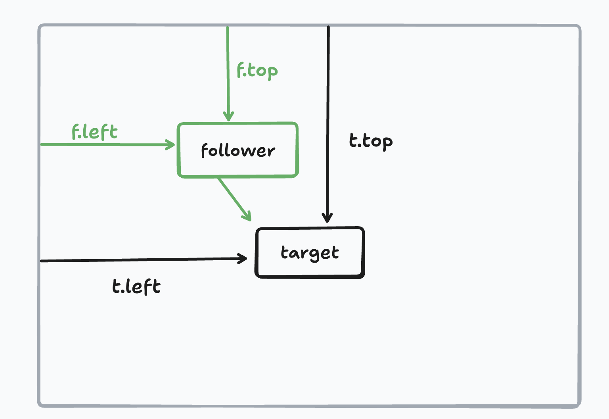
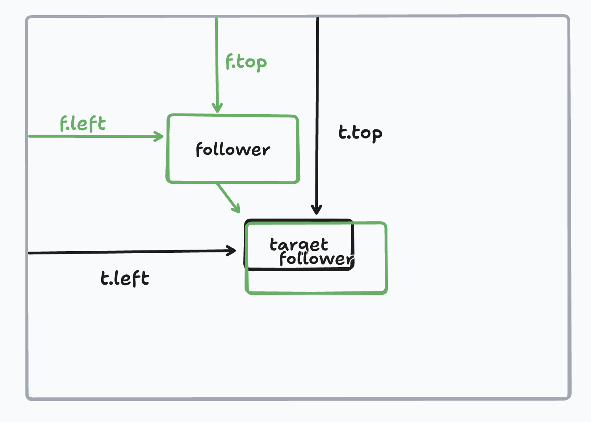
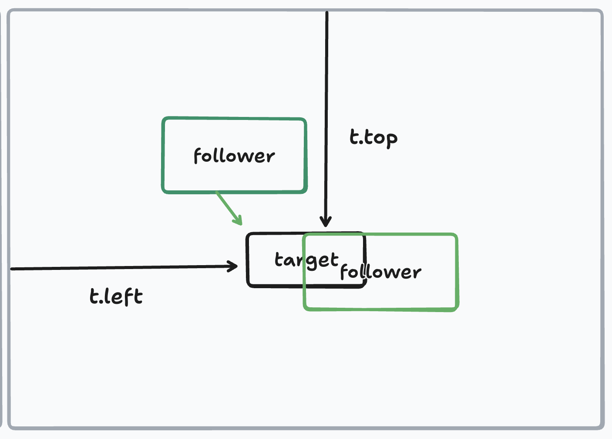
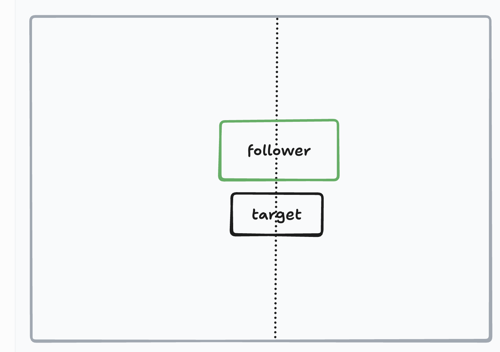
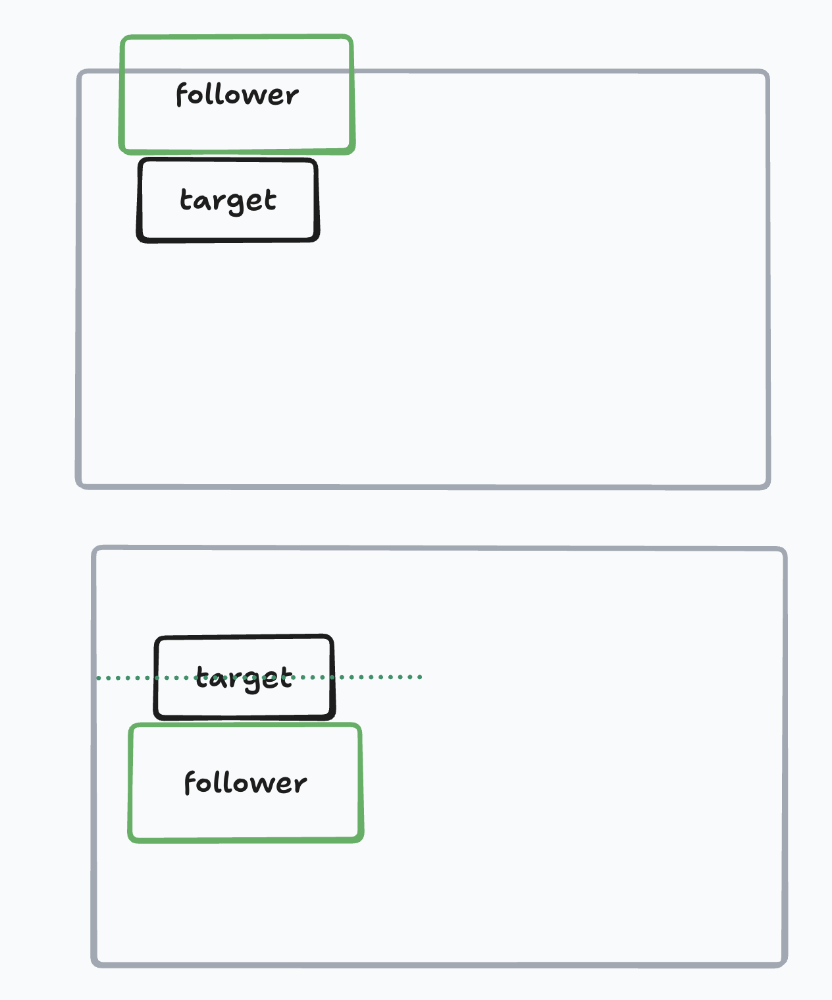
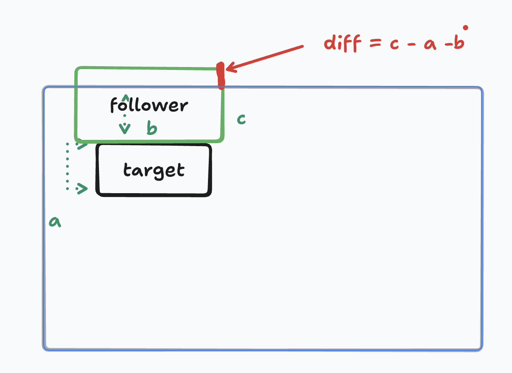

## 起因

https://github.com/tusen-ai/naive-ui/issues/7330

我最近在 naive 的 issue 发现了这个问题，排查发现是在 **SVG** 里使用 teleport 会失效（SVG 里放 HTML 节点并不合法），顺便回顾了一下 React 这类场景没问题是因为 `createPortal` 的机制不同。

也看了 floating-ui 和其他 popup 的方案，觉得给出一个 useFollow Hook 会是个合适的解决思路。

于是我便动手实现 顺带学习和梳理一下 popup 的设计和架构，重点理解一下这一套位置的计算逻辑

naive-ui 的所有 popup、select、cascader、menu、popover 都依赖于 @vueuc/binder（基于 Vue3 teleport 自己封的实现，整体比较复杂），如果你现在需要自己手写 popup 类的场景，推荐尝试 @floating-ui。

或许有同学会说原生的 popover 都要来了不要再自己写了 不过等到广泛可用的那天 前端或许早死了（逃命

以下内容假设读者理解和使用过 getBoundingClientRect、getComputedStyle、Vue3 Teleport、以及基本的 Vue3 组件开发, 如果没有请补课。

## 基本结构

@vueuc/binder 由三个组件构成

- Binder popup 的外层容器
- Target popup 目标/触发
- Follower popup 的内容
- getPlacementStyle 位置样式计算的核心逻辑

需要考虑当位置不够的时候可缩小（shift）或反转（flip）、重叠（overlap）。

## basic

从最简单的情况说起：不做 flip/shift/overlap。

假设我们想要的位置是在 top 那么 我们应该怎么计算呢

- `top = targetRect.top - offsetRect.top`

- `left = targetRect.left - offsetRect.left + targetRect.width/2`

- transform = 'translateY(-100%) translateX(-50%)'

top = targetRect.top - offsetRect.top

left = targetRect.left - offsetRect.left

是做了一件什么事情呢 看下面的图2会发现 它其实是把 follow 和 target 以各自的左上角为标准重叠在一起

我们通常情况下如果给一个 popover 传递一个 placement 是 top 那么我们隐含的意思其实是 top-center 所以我们还需要把 follower 右移动 target 得 1/2 宽度的距离 得到图3 这样的标准位置







到了这样标准的位置后，我们想一下对于 top-center 的 follow 应该在的位置

我们很容易想到做一个 transform 把follower 自身y轴移动一个follower 自身的高度 x 轴移动 1/2 f follower 的宽度这时候我们就得到了理想情况下的popover的效果



接下来要处理 flip / shift / overlap。

## flip

现实的情况target 如果比较靠边缘的话 follower 按既定的位置弹出就会超出可视范围 我可以可以考虑采取一些策略以保障能完全看到 follower

其中一个策略就是翻转：

- 当当前侧的空间小于对应的 follower 宽度或高度时，说明本侧放不下。
- 如果 **对侧空间比当前侧更大**（不要求“对侧一定完全放得下”），就翻转到对侧位置。

如何判断当前侧的空间不够

targetRect[position] < followerRect[propToCompare[position]]

什么意思还是拿 top 距离 targetRect[top] 就是 target 距离顶部的距离，而propToCompare[position] 可以得到应该用 follower 的 height 还是 width 来进行比较如果是top 那么我们应该使用 height 来比较

如何判断对侧的空间更大

我们构造了一个 map 在获取 相反方向的位置

```ts
const oppositionPositions: Record<Position, Position> = {
  top: "bottom",
  bottom: "top",
  left: "right",
  right: "left",
};
```

targetRect[position] < targetRect[oppositionPositions[position]]

只要对侧空间比当前侧更大就会翻转，并不要求对侧必须大于 follower 尺寸。



## align & shift

### align

## **总体前提**

- 仅在 `flip=true && overlap=false` 时运行这套逻辑。
- 变量：
  - `position`：主方向（top/bottom/left/right）
  - `align`：次方向（start/end/center，缺省为 center）
  - `offsetVertically = position === 'left' || position === 'right'`：决定补偿是改 top 还是 left
  - `deriveOffset(...)`：当溢出且 `shift`/`internalShift` 开启时，沿对齐轴平移以减少截断（默认 shift 是关闭的，需要显式打开才会发生平移）

## **非 center 对齐时（align = start/end）**

1. 先看“浮层在对齐轴尺寸”是否 **大于** 目标尺寸。若不大，则进入后面“浮层更小”兜底，否则继续。
2. 再看“当前对齐侧可用空间”是否 **小于** 浮层尺寸（放不下）。若能放下则不改 align。
3. 计算 `followerOverTargetSize = (followerSize - targetSize) / 2`，表示浮层比目标大出的一半。
4. 若当前侧或对侧任一侧空间 **小于** 这一半，说明对齐很吃紧，需要调整：
   - 比较当前侧 vs 对侧空间：谁更小、谁更大
   - 如果当前侧更小：将 align 反转到对侧（start↔end），并调用 `deriveOffset`（以对侧为基准）做微移
   - 如果当前侧不更小：保持 align，但仍对当前侧做 `deriveOffset` 微移
5. 如果两侧都紧但差距不大（都 ≥ 半溢出），则 **退回 center**（溢出对称分摊，视觉更均衡）。
6. 如果浮层在对齐轴反而 **小于** 目标尺寸（前面第1步的 else 分支）：当“当前对齐侧空间为负且对侧更大”时，也会把 align 反转

## **center 对齐时（align = center）**

1. 选出对齐轴两侧（主方向为 top/bottom → 轴是 left/right；主方向为 left/right → 轴是 top/bottom）。
2. 计算半溢出量 `followerOverTargetSize = (followerSize - targetSize) / 2`。
3. 如果任一侧空间小于这一半，说明 center 放不下，需要改成空间更大的那一侧对应的 start/end，并调用 `deriveOffset` 做微移。
4. 否则保持 center，不做偏移。

### shift

对于需要微调的场景，先计算溢出多少（以 top 为例）：

溢出的距离 = follower 主对齐轴的尺寸（width 或 height）减去 target 距离视口的距离，再减去 target 在主对齐轴上的尺寸。



```ts
const diff = followerRect[oppositeAlignCssSizeProp]
  - targetRect[alignCssPositionProp]
  - targetRect[oppositeAlignCssSizeProp];
```

```ts
const keepOffsetDirection: Record<Position, boolean> = {
  top: true, // top++
  bottom: false, // top--
  left: true, // left++
  right: false, // left--
};
```

然后用 keepOffsetDirection 决定 diff 的符号：true 是增加，false 是减少。比如顶部溢出来需要向下移动（增加 top），右边溢出需要往左移动。最终把溢出的部分拉回可视范围。

- 如果对齐侧是 top/left，偏移为正（往下/右移动，让溢出部分回到视口内）。
- 如果对齐侧是 bottom/right，偏移为负（往上/左移动）

### overlap

- **不参与 flip/shift**：一开始就早退返回 `{placement, 0, 0}`。
- `getOffset` 的 overlap 分支直接用 `translate` 把浮层“叠在”目标上：
  - 例：`bottom-start`：
    - `top = target.top - offset.top + target.height`
    - `left = target.left - offset.left`
    - `transform = 'translateY(-100%)'`（先把参考点放到目标左下角，再向上 100% 让浮层盖住目标）
- **transform-origin** 切到 `overlapTransformOrigin`：基点放在浮层“面向目标的那条边/角”。

## 结语

以上就是我对 popup 位置计算的理解的初略笔记，需要考虑的边界情况比较多, 所以代码会比较复杂，推荐使用成熟的库比如 floating-ui 来处理（不用自己算就没烦恼啦）

感兴趣的话还是可以看看 `vueuc/binder` 的源码实现
