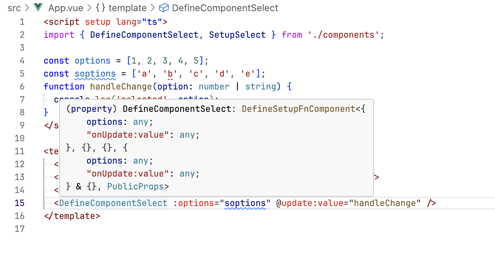

## 历史回顾以及为什么组件开发需要泛型

在 Vue3.3 以前 Vue3 的组件开发中存在的两大痛点

- 组件 props 不支持泛型
- slots 不支持类型

在 Vue3.3 之后，这两个问题都得到了解决[^1]，虽然没有写普通的 TypeScript 泛型那么符合直觉，但有可行的方案已是十分难得和巨大的进步

- 在组件的开发中有非常多的场景回调是需要传回对应数据的，
- 需要给 slots 的 props 传递数据

比如 `Select` `Table` `AvatarGroup` `Menu` `Dropdown` 等等的组件

下面我用 Select 组件来简单举个例子帮大家体会一下

## Vue3.3 之前

### props

#### 直觉

```tsx
function Select(props: {
  options: Array<{ label: string, value: string | number }>
  value: string | number
  onChange: (value: string | number, option: { label: string, value: string | number }) => void
}) {
  return ...
}
```

没有泛型的话这是一个非常直觉的写法但这并不足够。如果用户知道 option value 的类型其实只有 `string` 而此时的 `onChange` 回调的 `value` 类型还是 `string|number` 这就不够准确

#### workaround

```tsx
function Select(props: {
  options: Array<{ label: string, value: string | number }>
  value: string | number
  onChange: (value: string & number, option: { label: string, value: string & number }) => void
}) {
  return ...
}
```

使用 intersection types 代替 union types, 但这样的写法只是权宜之计，并不能从根本上解决问题，它有一些代价

- `onChange` 可以接受更多的类型了，但和 options 进行关联的工作交给了组件的使用者
- `string` 和 `number` 的交集其实是 `never`

```tsx
(value: string)=>void
(value: number)=>void
(value: string | number)=>void
```

#### 我们期待的

```tsx
function Select<Option>(props: {
  options: Option[]
  value: Option['value']
  onChange: (value: Option['value'], option: Option) => void
}) {
  return ...
}
```

在 Vue3.3 之前，这样的效果是无法实现的

### slots

Vue3.3 之前，slots 也无法支持类型，就更不奢谈泛型了
在 Vue3.3 之后，不光有了类型支持，还有了泛型支持

```ts
// before Vue3.3
type Slot = (...args: any[]) => VNode[];
// after
export type Slot<T extends any = any> = (
  ...args: IfAny<T, any[], [T] | (T extends undefined ? [] : never)>
) => VNode[];

export type InternalSlots = {
  [name: string]: Slot | undefined;
};

export type Slots = Readonly<InternalSlots>;

declare const SlotSymbol: unique symbol;
export type SlotsType<T extends Record<string, any> = Record<string, any>> = {
  [SlotSymbol]?: T;
};
```

在之前 Slots 的类型过于的宽泛，会有一些问题，可能有人会问到底有什么问题不就是 any 吗？

假如我们想对一个 `AutoComplete` 组件自定义输入框，并希望对 `onInput` 事件做类型上的检查约束 `onInput` 是没有类型的

```tsx
<auto-complete #="{ onInput }">
  <my-input @input="onInput" />
</auto-complete>
```

有了 props 的泛型支持和 slots 的类型支持，不论是组件的开发者还是组件的使用者都会受益

本人发表一个暴论:有人会说有没有泛型无所谓，你不需要复杂的类型，我认为持有这种说法如果不是不怎么碰这些场景就是自欺欺人习惯了

## 当下可行的四种路径

### script setup

Vue 3.3 给我们的答案

```vue
<script
  setup
  lang="ts"
  generic="type T<T extends string | number = string> =
  0"
>
import type { VNode } from "vue";

const props = defineProps<{
  options: T[];
  "onUpdate:value": (option: T) => void;
}>();

const slots = defineSlots<{
  extra: (props: { option: T }) => VNode[];
}>();

function handleChange(e: Event) {
  const value = (e.target as HTMLSelectElement).value as T;
  props["onUpdate:value"](value);
}
</script>
<template>
  <select @change="handleChange">
    <option v-for="option in props.options" :key="option" :value="option">
      {{ option }}
      <slot name="extra" :option="option" />
    </option>
  </select>
</template>
```

这个写法的肯定是不美观的，但大家都没有找到更好的解决方案，能有得用我心里只有感激🥹

这也是 Vue3 目前最省心的方式

### defineComponent

```tsx
import {
  defineComponent,
  type EmitsOptions,
  h,
  type SetupContext,
  type SlotsType,
} from "vue";

export default defineComponent(
  <T extends string | number = number>(
    props: {
      options: T[];
      "onUpdate:value": (option: T) => void;
    },
    { slots }: SetupContext<EmitsOptions, SlotsType<{ extra: { option: T } }>>,
  ) => {
    const { options } = props;

    function handleChange(e: Event) {
      const value = (e.target as HTMLSelectElement).value as T;
      props["onUpdate:value"](value);
    }
    console.log("options", options);
    return () => (
      <div>
        <select id="generic-select" onChange={handleChange}>
          {options?.map((option) => (
            <option value={option} key={option}>
              {option}
              {slots.extra?.({ option })}
            </option>
          ))}
        </select>
      </div>
    );
  },
  {
    // if you use defineComponent with generics, must `as any` when manually specify props
    // workaround for vue type issue
    props: ["options", "onUpdate:value"] as any,
  },
);
```

时至今日 defineComponent[^2] 的泛型支持依然是不完善的 对于 props 如果像上面那样使用泛型，仍然需要手动声明 props，不然的话在使用的地方就是 undefined

我个人认为还需要手动声明一遍 props 这个体验是不好的 应该也不少必须的，但暂且把他理解成一个实现上的 trade-off 吧

但是如果你按文档上指定 那么你的 IDE 会认为该 prop 类型是 any，你无法得到正确的提示，泛型也就失去了意义

workaround 是在手动指定 props 的时候 `as any` 这样你可以获得泛型支持(我倾向于认为这是个 Bug 暂时不清楚是 vue 的原因还是 volar 的原因)



### 上科技 vue-jsx-vapor 插件

使用 [vue-jsx-vapor](https://jsx-vapor.netlify.app/) 可以获得近乎于 react function component 的体验

在它的 playground 里的 Expose 这个文件里你可以看到泛型组件的写法 [playground](https://repl.zmjs.dev/vuejs/vue-jsx-vapor?main=src%2FExpose.tsx&config=tsconfig.json)

### 曲线路径

- 如果你的现有代码库是 TSX 且你想维持 tsc 做构建
- 不想从头到脚的做泛型重构
- 不想完全重构为 script setup
- 不想使用插件

有这样一条路径吗？有的兄弟 有的

Naive-UI 给我们找到了这样的一条路，但这是一条曲折的路
多说一句如果你一开始就可以使用 script setup 的话泛型这个场景还是选择 script setup 吧
他享有 Vue 最大力度大支持，其他的用法在 Vue 里不是一等公民有不少的坑要自己踩，一些优化也享受不到

闲话说完了下面我们来看看这条路具体怎么走

核心思想是通过一个 SFC 使用 script setup 包裹一层基础组件

#### 定义类型

```ts
// public-types.ts
import type { VNode } from "vue";

export type Option = string | number;

export type OnUpdateValue<T> = (option: T) => void;

export type GDSelectProps<T extends Option = Option> = {
  options: T[];
  "onUpdate:value": OnUpdateValue<T>;
};

export type GDSelectSlots<T extends Option = Option> = {
  extra: (props: { option: T }) => VNode[];
};
```

#### 写一个普通组件

使用 TSX defineComponent 写一个普通组件 可以通过 slots 选项定义 slots 的类型

```tsx
// BasicSelect.tsx
import { defineComponent, h, type PropType, type SlotsType } from "vue";
import type { GDSelectSlots, OnUpdateValue, Option } from "./public-types";

export const selectProps = {
  options: {
    type: Array as PropType<Option[]>,
    default: () => [],
  },
  "onUpdate:value": Function as PropType<OnUpdateValue<Option>>,
};

export default defineComponent({
  props: selectProps,
  slots: Object as SlotsType<GDSelectSlots<Option>>,
  setup(props) {
    function handleChange(e: Event) {
      const value = (e.target as HTMLSelectElement).value;
      props["onUpdate:value"]?.(value);
    }
    return {
      handleChange,
    };
  },
  render() {
    const { options, handleChange, $slots } = this;
    return (
      <select id="g-select" onChange={handleChange}>
        {options?.map((option) => (
          <option value={option} key={option}>
            {option}
            {$slots.extra?.({ option })}
          </option>
        ))}
      </select>
    );
  },
});
```

#### Wrap 组件

通过 script setup 包裹一层基础组件, 得到范型支持

但是你需要使用一下 `as any` 和 `v-bind` 可能有些强迫症不友好 但是这是 work 的😭

```tsx
<script 
  setup 
  lang="ts" 
  generic="T extends Option = Option"
>
import BasicSelect from './BasicSelect';
import type { GDSelectProps, GDSelectSlots, Option } from './public-types';

defineProps<GDSelectProps<T>>()
defineSlots<GDSelectSlots<T>>()
</script>

<template>
  <BasicSelect v-bind="$props as any">
    {{ $props }}
    <template #extra="props">
      <slot name="extra" v-bind="props as any" />
    </template>
  </BasicSelect>
</template>
```

做完上述步骤你就可以得到一个泛型组件了

## 总结

Vue3.3 之后类型的体验得到了很大的加强，泛型组件的开发也有了可行的方案

如果想获得最佳体验还是建议使用 script setup 其他的方式或多或少没那么完整，比如 defineComponent 的泛型支持就仍然不完善

今天就聊到这里，上述所有的代码我放在 [vue3-generics-example](https://github.com/Sepush/vue3-generics-example)

[^1]: Vue 3.3 的新特性 [官方博客](https://blog.vuejs.org/posts/vue-3-3)

[^2]: Vue 3.3 之后的 defineComponent [官方文档](https://vuejs.org/api/general.html#definecomponent)
